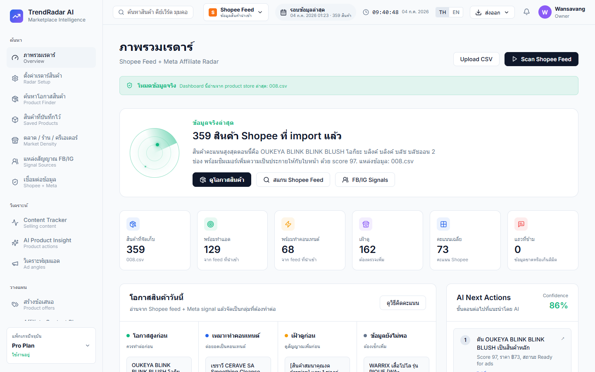
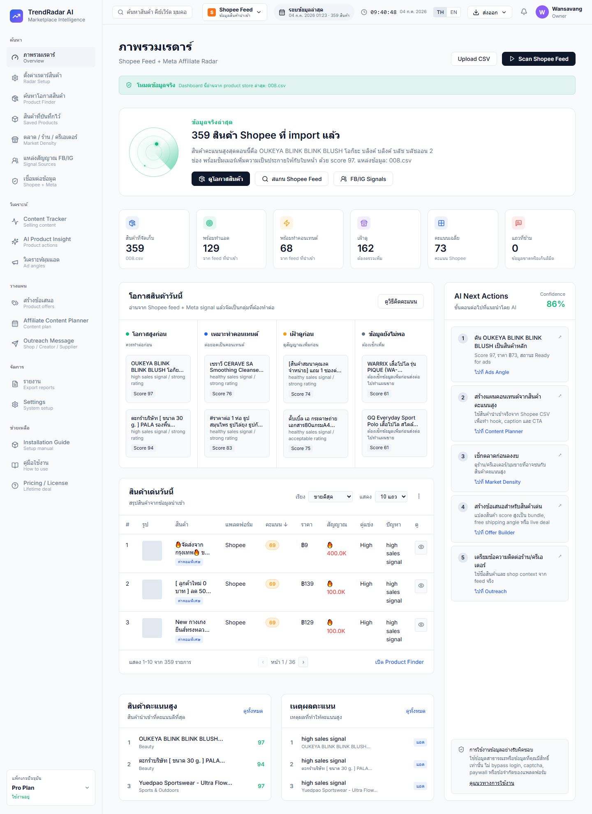

# TrendRadar AI



TrendRadar AI คือระบบ Marketplace Intelligence แดชบอร์ดที่ช่วยให้คุณค้นหาโอกาสของสินค้าจาก Shopee Feed และ Meta Affiliate โดยเชื่อมต่อข้อมูลและวิเคราะห์แนวทางการขาย แอด และคอนเทนต์โดยอัตโนมัติ

## 🚀 Live Demo
ทดลองใช้งานเว็บไซต์ได้ที่: **[TrendRadar AI (Vercel)](https://trendradar-ai-zeta.vercel.app/)**

## 📸 ผลลัพธ์การทำงาน
ภาพหน้าจอจาก Live Demo บันทึกเมื่อ 7 ต.ค. 2569 (หน้าจอกว้าง 1440 px)

หน้า **ภาพรวมเรดาร์ (Overview)** แสดงผลจากข้อมูลจริงที่นำเข้าจาก `008.csv`:

| ตัวชี้วัด | ค่า |
|---|---|
| สินค้าที่จัดเก็บ | 359 |
| พร้อมทำแอด | 129 |
| พร้อมทำคอนเทนต์ | 68 |
| เฝ้าดู | 162 |
| คะแนนเฉลี่ย | 73 |
| แถวที่ข้าม | 0 |

- **โอกาสสินค้าวันนี้:** จัดกลุ่มสินค้าเป็น 4 กลุ่ม คือ โอกาสสูงก่อน, เหมาะทำคอนเทนต์, เฝ้าดูก่อน และข้อมูลยังไม่พอ
- **AI Next Actions:** แนะนำขั้นตอนถัดไป 5 ข้อ (Confidence 86%)
- **สินค้าเด่นวันนี้:** ตารางสรุปสินค้าพร้อมคะแนน ราคา และสัญญาณยอดขาย (แสดง 1–10 จาก 359 รายการ)



## 🛠 เทคโนโลยีที่ใช้งาน
- HTML5
- CSS3 (Vanilla CSS, Light Theme Dashboard)
- JavaScript

## 📦 การติดตั้งและการใช้งานในเครื่อง (Local Development)

หากคุณต้องการนำโปรเจกต์นี้ไปพัฒนาต่อในเครื่องของคุณเอง สามารถทำตามขั้นตอนด้านล่างได้เลยครับ:

### 1. โคลนโปรเจกต์ลงเครื่อง
เปิด Terminal หรือ Command Prompt และใช้คำสั่งนี้เพื่อดาวน์โหลดโค้ด:
```bash
git clone https://github.com/mehappyx4/TrendRadar-AI.git
```

### 2. เข้าสู่โฟลเดอร์โปรเจกต์
```bash
cd TrendRadar-AI
```

### 3. เปิดใช้งาน (Run)
เนื่องจากโปรเจกต์นี้เขียนด้วย HTML, CSS และ JS บริสุทธิ์ (Vanilla) คุณจึงไม่ต้องติดตั้ง Node.js หรือ dependencies ใดๆ คุณสามารถเปิดใช้งานได้ 2 วิธี:

**วิธีที่ 1: รันผ่านโปรแกรม Live Server (แนะนำ)**
- หากคุณใช้ **VS Code** ให้ติดตั้ง Extensions ชื่อ `Live Server`
- คลิกขวาที่ไฟล์ `index.html` แล้วเลือก **"Open with Live Server"**

**วิธีที่ 2: เปิดผ่านเบราว์เซอร์โดยตรง**
- ดับเบิลคลิกที่ไฟล์ `index.html` เพื่อดูผลลัพธ์ผ่านเว็บเบราว์เซอร์ได้ทันที

## ☁️ การนำขึ้น Vercel ด้วยตัวเอง (Deployment)
โปรเจกต์นี้ได้ตั้งค่าเชื่อมต่อกับ Vercel ให้ทำงานอัตโนมัติ หากคุณแก้ไขโค้ดแล้ว `git push` ระบบจะนำโค้ดล่าสุดขึ้นเว็บให้ทันที 

หากต้องการ Deploy ด้วยตัวเองผ่าน Vercel CLI:
```bash
npx vercel --prod
```

---
*พัฒนาโดย TrendRadar AI Team*
